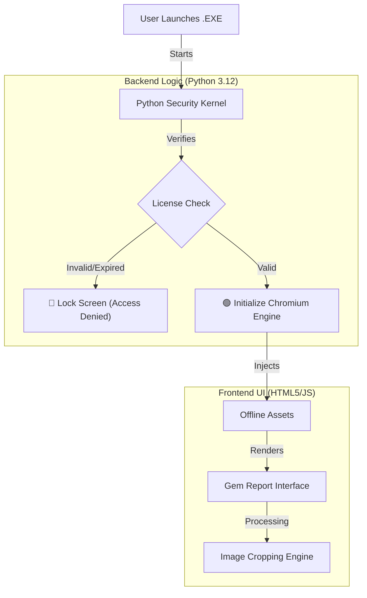
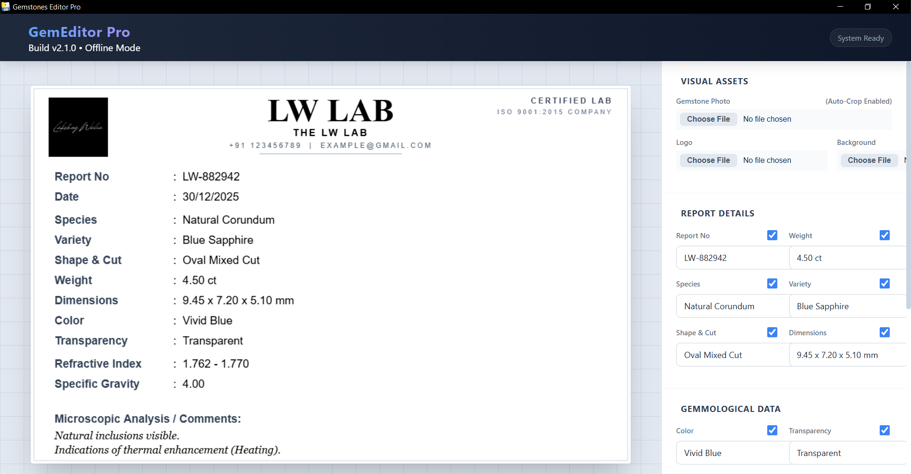
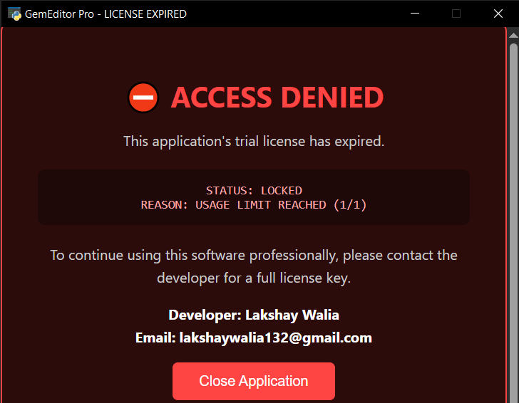

# 💎 GemEditor Pro: Secure Hybrid Desktop Application
DEMO LIVE { https://lakshaywalia05.github.io/reportmaker }

  

**GemEditor Pro** is a secure, proprietary desktop software developed for Gemology Labs to generate high-fidelity authentication reports.

This project demonstrates a **Hybrid Architecture**, leveraging the system-level security of **Python** with the modern, responsive UI capabilities of **HTML5 & TailwindCSS**. The application is compiled into a single, standalone executable that runs 100% offline.

### 📥 Download Demo
[-blue?style=for-the-badge&logo=windows)](https://github.com/lakshaywalia05/GemCardApp/archive/refs/tags/v1.0.zip)

*(Click the button above to download the secure Windows .exe)*

---

## 🏗️ Architecture Design

The application runs a secure Python backend that acts as a "Security Shell" around a modern Chromium-based frontend.

🛠️ Technology Stack
Language: Python 3.12

GUI Engine: PyWebView (Chromium Wrapper)

Frontend: HTML5, TailwindCSS (Utility-First)

Security: Custom DRM Logic (Local File Encryption)

Build Tool: PyInstaller (One-File compilation)

⚠️ Note on Source Code
This is a commercial application. The full source code is stored in a private repository to protect the intellectual property and security algorithms.

Developer: Lakshay Walia Contact: lakshaywalia132@gmail.com
| **Main Dashboard** | **Security Lock Screen** |
|:---:|:---:|
|  |  |
